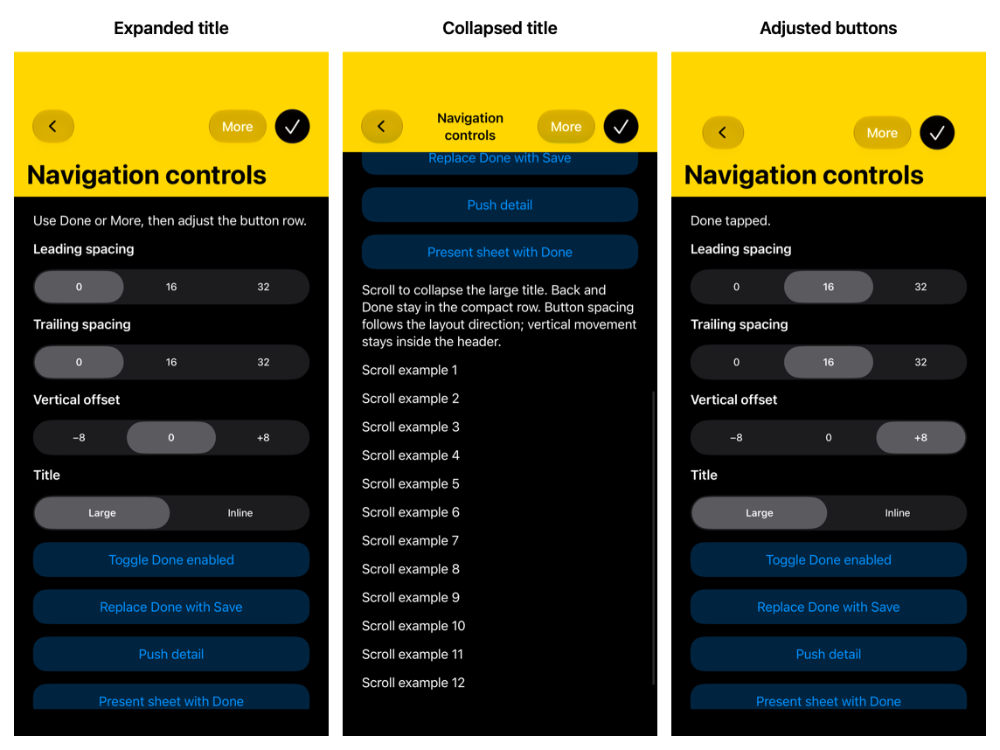

# CustomNavigationController

A small UIKit Swift package for custom-height navigation headers, navigation-item buttons, and scrolling large titles. Keep the original 66-point look, choose your own spacing and colors, and use UIKit's push, pop, edge-swipe, and modal transitions.

**iOS / iPadOS 15+ · Swift tools 5.9+ · No dependencies**

The header is an ordinary view owned by each screen. It uses safe areas and Dynamic Type instead of resizing UIKit's internal navigation bar. The design supports modern iOS; tested versions and remaining gaps are listed in [validation](docs/validation.md).

## Install

In Xcode, add a package dependency using [this repository](https://github.com/ShawnBaek/CustomNavigationController), choose the **master branch**, and select the **CustomNavigationController** product for your app target. Use the branch rule until a versioned package release is tagged.

For local development, add this checkout as a local package. The included `CustomNavigationBar.xcodeproj` already consumes the same package.

For another local Swift package:

```swift
// In Package.swift:
dependencies: [
    .package(path: "../CustomNavigationController")
],
targets: [
    .target(name: "YourFeature", dependencies: [
        .product(name: "CustomNavigationController", package: "CustomNavigationController")
    ])
]
```

## Use with existing screens

Keep your existing view controller and its layout:

```swift
import UIKit
import CustomNavigationController

let home = HomeViewController()
home.title = "Home"
let navigation = CustomNavigationController(contentViewController: home)
navigation.headerHeight = 66
navigation.headerBackgroundColor = .systemYellow
navigation.headerTintColor = .black
navigation.statusBarStyle = .darkContent
window.rootViewController = navigation
window.makeKeyAndVisible()
```

Push another existing screen:

```swift
let detail = DetailViewController()
detail.title = "Details"
let screen = navigation.pushContentViewController(detail)
screen.header.onTitleTap = { [weak detail] in
    detail?.showTitleDetails()
}
```

The helper embeds your controller below a header and returns the wrapper placed on the navigation stack. Initial `title` (or `navigationItem.title`) is copied, including a title set in `viewDidLoad`. For later changes, set `screen.title`. Pass controllers that do not already have a parent.

## Build a new screen

Subclass `CustomNavigationViewController` and pin content to `contentLayoutGuide`:

```swift
final class DetailsScreen: CustomNavigationViewController {
    override func viewDidLoad() {
        super.viewDidLoad()
        title = "Details"
        let label = UILabel()
        label.text = "Your content"
        label.translatesAutoresizingMaskIntoConstraints = false
        view.addSubview(label)
        NSLayoutConstraint.activate([
            label.topAnchor.constraint(equalTo: contentLayoutGuide.topAnchor, constant: 24),
            label.leadingAnchor.constraint(equalTo: contentLayoutGuide.leadingAnchor, constant: 24),
            label.trailingAnchor.constraint(lessThanOrEqualTo: contentLayoutGuide.trailingAnchor, constant: -24)
        ])
    }
}

// Header-capable screens use the normal UIKit stack API.
let navigation = CustomNavigationController(rootViewController: DetailsScreen())
navigation.pushViewController(DetailsScreen(), animated: true)
```

The preferred height excludes the top safe area, has a 44-point minimum, and grows for larger text. Titles use up to two visual lines; accessibility receives the full title. Colors adapt to light/dark appearance by default, and the status bar is visible unless `hidesStatusBar` is enabled. `backButtonAccessibilityLabel` and `closeButtonAccessibilityLabel` let your app supply localized labels.

## Buttons and large titles

Set `navigationItem.leftBarButtonItems` and `rightBarButtonItems` on your screen as usual. UIKit renders the original items, including Done/Cancel, images, custom views, actions, and menus. Wrapped controllers use their content controller's navigation item. Call `reloadNavigationItems()` on the header owner after replacing items or changing display modes while visible.

```swift
navigation.buttonLayout = NavigationButtonLayout(
    leadingInset: 16, trailingInset: 24, verticalOffset: 6
)
navigation.prefersLargeTitles = true
let list = UITableViewController(style: .plain)
list.title = "Library"
list.navigationItem.largeTitleDisplayMode = .always
let screen = navigation.pushContentViewController(list)
screen.largeTitleScrollView = list.tableView
screen.reloadNavigationItems()
```

Spacing is added around the native button row; UIKit keeps its internal item padding. By default, buttons are vertically centered at every compact navigation height (`verticalOffset: 0`). Large titles expand below that row. An explicit vertical offset moves the button row independently of the title and is limited to the available header space. Use `screen.buttonLayoutOverride` for a per-screen setting.

Large titles expand below the compact row and collapse as the selected scroll view moves. The package adds a reversible top inset and preserves the scroll delegate. Without a selected scroll view, content starts below the complete expanded header.



For button examples, storyboard / `IBOutlet` adoption, and container boundaries, see the [adoption guide](docs/adoption.md). Search controllers, native large-title animations, navigation menus, and complete OS navigation-bar appearance remain outside this custom header's contract.

## Run the sample

Open `CustomNavigationBar.xcodeproj`, select `CustomNavigationBar`, and run on an iPhone or iPad Simulator. Try the original height and transition controls, then open **Navigation buttons & large titles** for Done/More actions, spacing controls, item replacement, and scroll collapse.

[Architecture](docs/architecture.md) · [Tests and verification status](docs/validation.md) · [MIT license](LICENSE)
